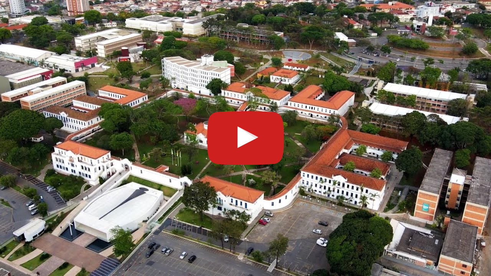

# Spectro Buddy

O projeto objetiva ajudar pessoas do espectro autista a serem mais
independentes auxiliando no controle dos remédios que devem ser tomados, no
controle de crises e no acompanhamento das tarefas diárias; auxiliando, assim,
no desenvolvimento intelectual, cognitivo e social dos usuários. Esses objetivos
foram traçados tendo em vista a dificuldade que essas pessoas possuem em
realizar tarefas simples do cotidiano, muitas vezes as tornando dependentes de
um outro alguém.

## Alunos integrantes da equipe

* [Gabriel Luís Pinto Cecconello](https://github.com/gabrielcecconello)
* [Leonardo Piuzana Pizani](https://github.com/LeoPizani)
* [Paula Cristina Talim Gonçalves](https://github.com/paulatalim)
* [Rafael Vicente Souza E Paula](https://github.com/Fael2)

## Professor responsável

* [Felipe Augusto Lima Reis](https://github.com/falreis)

## Gerenciamento do Projeto

......  COLOQUE AQUI O SEU TEXTO (OPCIONAL) ......

> Adicione aqui informações sobre o projeto que será gerenciado. 
> Indique informações importantes sobre o projeto.

Fases do Gerenciamento do Projeto:
1. [Iniciação](docs/01-iniciacao)
2. [Planejamento](docs/02-planejamento)
3. [Execução](docs/03-execucao)
4. [Monitoramento](docs/04-monitoramento)
5. [Encerramento](docs/05-encerramento)

## Apresentação do Trabalho

......  COLOQUE AQUI O SEU TEXTO ......

> Adicione aqui o vídeo explicativo do trabalho.
> Utilize a estrutura (link) abaixo para apresentação do vídeo.
> O vídeo deve ser postado obrigatoriamente de forma pública no Youtube ou qualquer outra plataforma 

> A imagem abaixo deve ser substituída por uma capa do vídeo de apresentação do trabalho.

## Informações Adicionais

......  COLOQUE AQUI O SEU TEXTO ......

> Inclua aqui informações extra sobre o projeto.
> Caso não existam informações extras, remova a seção.
